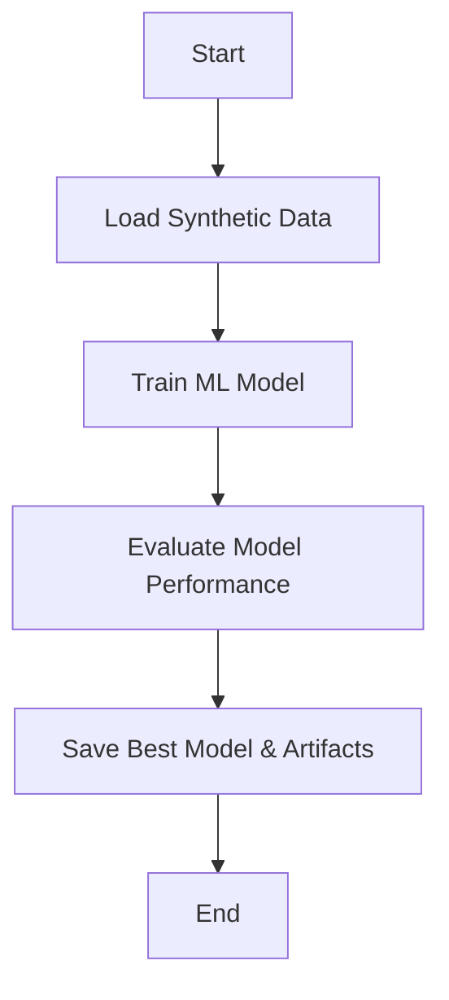
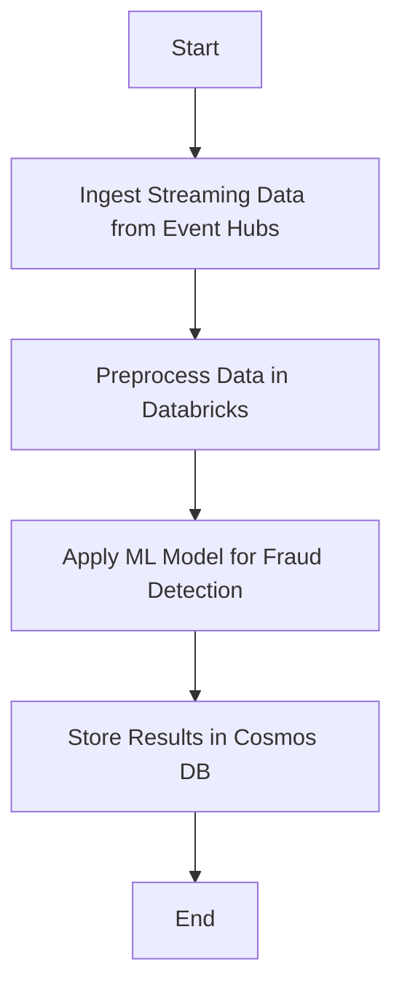

# Real-time Fraud Detection with Azure Databricks

## Overview
This project demonstrates a real-time fraud detection system using machine learning and Azure Databricks. It processes streaming transaction data from Azure Event Hubs, applies an ML model to classify transactions as Suspicious or Benign, and stores the results in Azure Cosmos DB.

## Architecture


### Components:
- **Data Ingestion:** Real-time transaction data is streamed through **Azure Event Hubs**.
- **Processing:** **Azure Databricks** (Structured Streaming) processes and transforms the data.
- **Machine Learning:** A trained ML model predicts fraudulent transactions.
- **Storage:** Processed data, including predictions, is stored in **Azure Cosmos DB**.
- **Security:** **Azure Key Vault** and **Service Principal** are used for secure authentication.

## Workflow
### Model Training Workflow


### Real-time Fraud Detection Workflow


## Technologies Used
- **Azure Services:** Databricks, Event Hubs, Cosmos DB, Key Vault
- **Machine Learning:** Python, scikit-learn, pickle format for model storage
- **Streaming:** Spark Structured Streaming, Delta Lake

## Getting Started
### Prerequisites
- Azure subscription
- Databricks workspace with Unity Catalog enabled
- Event Hub with streaming data source
- Cosmos DB instance
- Azure Data Lake Storage (ADLS)

### Setup
1. **Train the ML Model**
   - The `syntheticdata.ipynb` notebook trains an ML model using synthetic transaction data.
   - The best model and required artifacts are saved in pickle format.

2. **Deploy Real-time Streaming Pipeline**
   - The `v2 Real-time Data Processing with Azure Databricks.ipynb` notebook:
     - Connects to Event Hubs for real-time ingestion.
     - Applies preprocessing and feature engineering.
     - Loads the trained ML model and classifies transactions.
     - Writes the enriched data to Cosmos DB.

### Sample Input Data
```json
{
  "TransactionID": 199,
  "Timestamp": "2023-02-08 16:53:34",
  "CustomerID": 666184,
  "Amount": 2656.82,
  "Location": "Chicago",
  "CardType": "Visa",
  "TransactionType": "Refund",
  "ProductCategory": "Automotive",
  "Duration": "00:23:56"
}
```

### Running the Pipeline
1. Mount ADLS storage in Databricks using Azure Key Vault secrets.
2. Start the structured streaming job in Databricks.
3. Monitor predictions in Cosmos DB.

## Future Enhancements
- Implement real-time alerting for suspicious transactions.
- Integrate with Power BI for live fraud analytics dashboards.
- Enhance the ML model with additional transaction features.

## Author
Sai - Data Engineer specializing in real-time data processing and fraud analytics.

## License
MIT License
